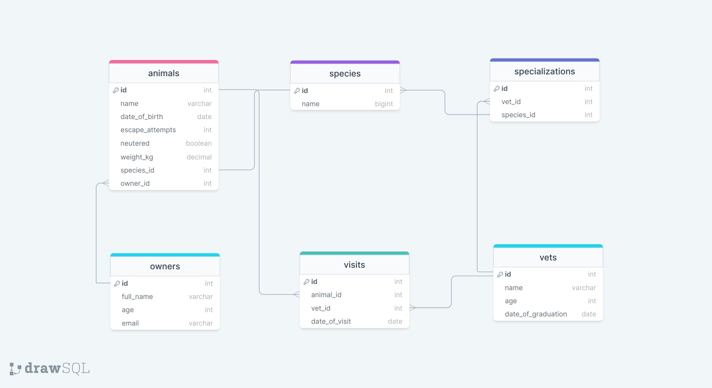

# VET CLINIC DATABASE

<a name="readme-top"></a>

# 📗 Table of Contents

- [📖 About the Project](#about-project)
  - [🛠 Built With](#built-with)
    - [Tech Stack](#tech-stack)
    - [Key Features](#key-features)
  - [🚀 Live Demo](#live-demo)
- [💻 Getting Started](#getting-started)
  - [Setup](#setup)
  - [Prerequisites](#prerequisites)
- [👥 Authors](#authors)
- [🔭 Future Features](#future-features)
- [🤝 Contributing](#contributing)
- [⭐️ Show your support](#support)
- [🙏 Acknowledgements](#acknowledgements)
- [📝 License](#license)

# 📖 Vet Clinic Database <a name="about-project"></a>



In this project, I used a relational database to create the initial data structure for a vet clinic. The database has a table that stores animal data. Data can be inserted into the table, and the table can be queried as well.

## 🛠 Built With <a name="built-with"></a>

### Tech Stack <a name="tech-stack"></a>

<summary>Database</summary>
  <ul>
    <li><a href="https://www.postgresql.org/">PostgreSQL</a></li>
  </ul>
</details>

### Key Features <a name="key-features"></a>

- **Queries**
- **Data insertion**

<p align="right">(<a href="#readme-top">back to top</a>)</p>

## 🚀 Live Demo <a name="live-demo"></a>

- Live Demo link comming soon.

<p align="right">(<a href="#readme-top">back to top</a>)</p>

## 💻 Getting Started <a name="getting-started"></a>

This repository includes files with plain SQL that can be used to recreate a database:

- Use [schema.sql](./schema.sql) to create all tables.
- Use [data.sql](./data.sql) to populate tables with sample data.
- Check [queries.sql](./queries.sql) for examples of queries that can be run on a newly created database. **Important note: this file might include queries that make changes in the database (e.g., remove records). Use them responsibly!**

To get a local copy up and running, follow these steps.

### Prerequisites

In order to run this project you need:

- To install [PostgreSQL](https://www.postgresql.org/)

### Setup

Clone this repository to your desired folder:

```sh
  cd my-folder
  git clone https://github.com/Timbar09/Vet-Clinic-Database.git
```

<p align="right">(<a href="#readme-top">back to top</a>)</p>

<!-- AUTHORS -->

## 👥 Authors <a name="authors"></a>

| 👤 Author | GitHub | Twitter | LinkedIn |
| :-- | :-- | :-- | :-- |
| Miles Mosweu | [@Timbar09](https://github.com/Timbar09) | [@Milez09](https://twitter.com/Milez09) | [@miles-mosweu09](https://www.linkedin.com/in/miles-mosweu09) |

<p align="right">(<a href="#readme-top">back to top</a>)</p>

## 🔭 Future Features <a name="future-features"></a>

- [ ] **Add more Tables**

<p align="right">(<a href="#readme-top">back to top</a>)</p>

## 🤝 Contributing <a name="contributing"></a>

Contributions, issues, and feature requests are welcome!

Feel free to check the [issues page](https://github.com/Timbar09/Vet-Clinic-Database/issues).

<p align="right">(<a href="#readme-top">back to top</a>)</p>

## ⭐️ Show your support <a name="support"></a>

If you like this project, give it a ⭐️ and let me know what you like in particular.

<p align="right">(<a href="#readme-top">back to top</a>)</p>

<!-- ACKNOWLEDGEMENTS -->

## 🙏 Acknowledgments <a name="acknowledgements"></a>

I would like to thank [Amigoscode](https://www.youtube.com/@amigoscode) for the helpful [PostgreSQL tuorial](https://www.youtube.com/watch?v=BLH3s5eTL4Y).

<p align="right">(<a href="#readme-top">back to top</a>)</p>

## 📝 License <a name="license"></a>

This project is [MIT](./LICENSE) licensed.

<p align="right">(<a href="#readme-top">back to top</a>)</p>
